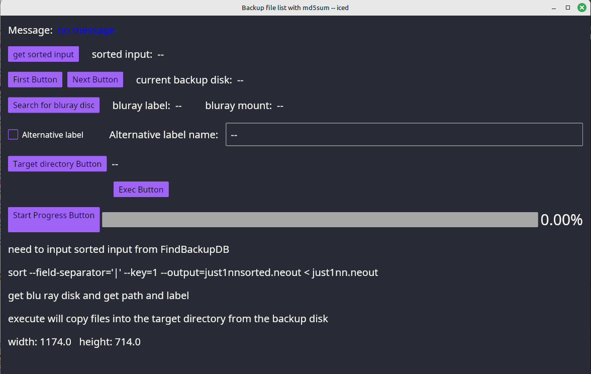

# restorefiles
Rust-Iced program: Reads sorted list of files from findbackupDB and prompts to load bluray or dvd backup disk that has files to restore.

This program calls winitsize01 to get the smallest monitor size

